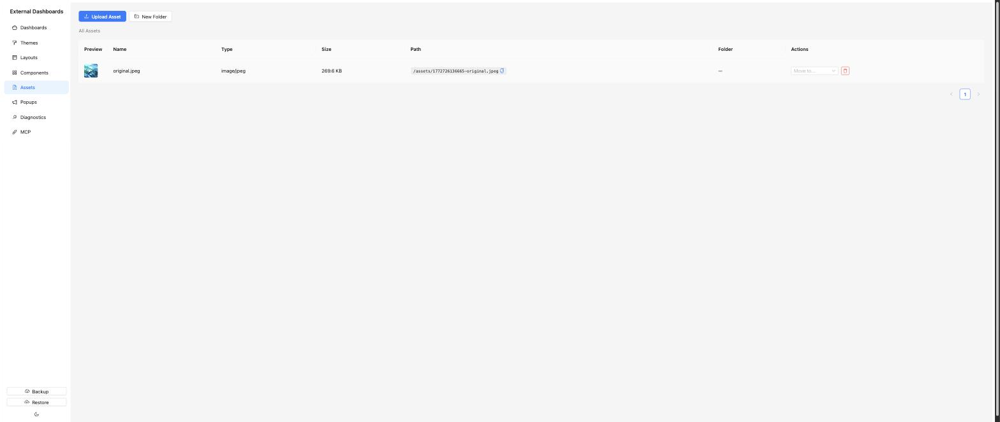

# Assets

Static files (images, videos, fonts) stored on disk at `/config/assets/` and served back to dashboards. Useful for logos, background images, icons used by the image card, popup media, etc.

## List page

Folder navigation appears at the top — the root view shows a row of folder buttons, plus a breadcrumb when you enter one. Folders are virtual (stored as a string column on each asset, not real directories).

Columns:

- **Preview** — thumbnail for images.
- **Name** — human-readable name.
- **Type** — mime type / category.
- **Size** — file size.
- **Path** — `/assets/<file>`. A copy-path button next to the value copies the URL to the clipboard.
- **Folder** — the virtual folder the asset belongs to.
- **Actions** — *Move to..* dropdown (move to another folder) and *Delete*.

Page-level buttons:

- **Upload Asset** — drag-and-drop or file-picker upload. Each uploaded file gets a unique on-disk filename; the human-readable name is stored separately.
- **New Folder** — creates a new virtual folder you can move assets into.

Anywhere a component parameter uses the `asset` type, the picker lists assets from this screen. Themes and popups use the same picker for background images and media.
