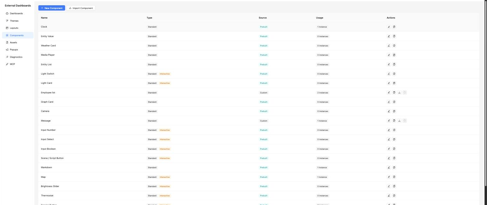
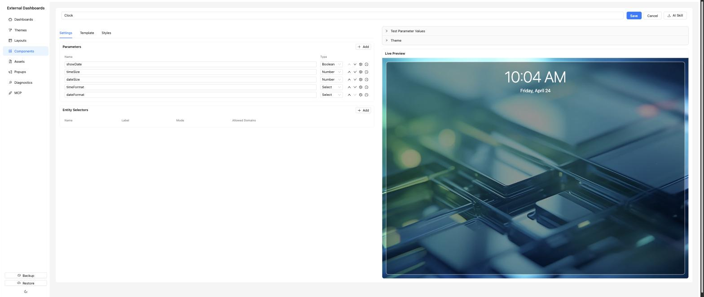

# Components

Components are the reusable bricks dropped into layout regions. Each one has a Handlebars template, a CSS block, a set of parameter definitions, and a set of entity selector definitions. They render per-instance with live HA state via WebSocket.

## List page

Columns: **Name**, **Type** (Standard / Container), **Usage**. Page actions: *New Component*, *Import Component*. Per-row: *Edit*, *Duplicate*, *Export*, *Delete* (blocked when in use).

Prebuilt components ship with the add-on (clock, weather, image card, entity card, graph card, etc.). They show with a "Prebuilt" tag and cannot be edited directly — duplicate them first and edit the copy.

## Editor

The editor is a split view. The left column is the authoring surface; the right column is the live preview. The component **Name**, *Save* / *Cancel* buttons and an *AI Skill* button (downloads an authoring guide you can feed to an assistant) sit at the top-right of the page header.

### Left column — authoring

The left column has three tabs:

#### Settings

Two tables:

- **Parameters** — user-visible inputs offered when the component is placed on a dashboard. Each parameter has a name, label, and type. Types:

  | Type | Control rendered when placing the component |
  |------|---------------------------------------------|
  | `string` | Text input |
  | `number` | Numeric input (optional `step`) |
  | `boolean` | Switch |
  | `color` | Color picker |
  | `select` | Dropdown (requires `options`) |
  | `icon` | MDI icon picker |
  | `asset` | Asset picker |
  | `textarea` | Multiline text |

- **Entity Selectors** — the HA entities the component expects to be bound to. Each has a name, label, and mode:

  | Mode | Usage | Notes |
  |------|-------|-------|
  | `single` | One entity per instance. | Optionally restrict `allowedDomains`. |
  | `multiple` | Fixed list of entities. | Users pick several. |
  | `glob` | A pattern like `sensor.*_temperature`. | Expanded server-side; new matching entities appear live. Supports attribute and state filters to narrow the match. |

Optional **Container config** on this tab turns the component into a container that itself has child regions (used by the prebuilt Tabs and Carousel containers).

#### Template

The Handlebars source. Common helpers:

- `{{param "brightness"}}` — read a parameter value (always use `param`, not bare `{{brightness}}`).
- `{{entity "my_light"}}` — read an entity's full state object (`.state`, `.attributes.friendly_name`, …).
- `{{#eachEntity "sensors"}} … {{/eachEntity}}` — iterate over a multi/glob entity binding. Supports render-time hash filters: `domain`, `state`, `stateNot`, `attr`, `attrValue`, `sortBy`, `sortDir`.
- `{{deriveEntity entity_id "sensor" "_battery"}}` — derive a related entity id inside a loop.
- `{{mdiIcon "mdi-lightbulb"}}` — inline an MDI icon SVG path (resolved server-side).
- `{{globalStyles.myVar}}` — access theme custom variables.

#### Styles

Component-scoped CSS. The renderer already applies theme chrome externally; keep internal layout and typography here.

### Script modes

By default, any `<script>` in a component template re-runs on every entity state change (the renderer replaces innerHTML and re-executes scripts). If your component manages its own DOM (a chart, a map, anything stateful), add `data-script-once` to an element in the template. In run-once mode the script executes only on mount and further entity updates don't touch the DOM — your code is responsible for reading new state itself.

### Right column — live preview

- **Preview pane** — renders the component against a chosen theme with the test bindings and parameters you enter below.
- **Theme** picker — collapsible; pick which saved theme the preview should use.
- **Test Parameter Values** — collapsible; set test values for each parameter.
- **Test Entity Bindings** — assign real HA entities so you can see the template render against live state. These bindings are saved on the component and reused next time you open it.
- **Entity Data Viewer** — expandable panel showing the raw JSON of the currently bound entities. Invaluable when building a template and you need to see exactly what attributes are available.

## Import / export

Export gives you a versioned JSON file with name, template, styles, parameter defs, entity selector defs, container config, and test bindings. Import uploads that JSON. Name collisions are suffixed with `(Imported)`.

## Gotchas

- Components in use cannot be deleted (409).
- Prebuilt components cannot be edited — duplicate first.
- Glob filters are re-evaluated on every state change: an entity that stops matching is un-subscribed and re-subscribed live when it matches again.

---

For a deeper reference on template syntax, available helpers and entity selector behaviour, see [../component-authoring.md](../component-authoring.md).
