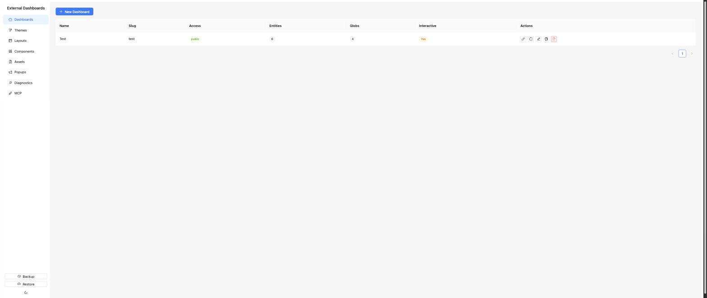
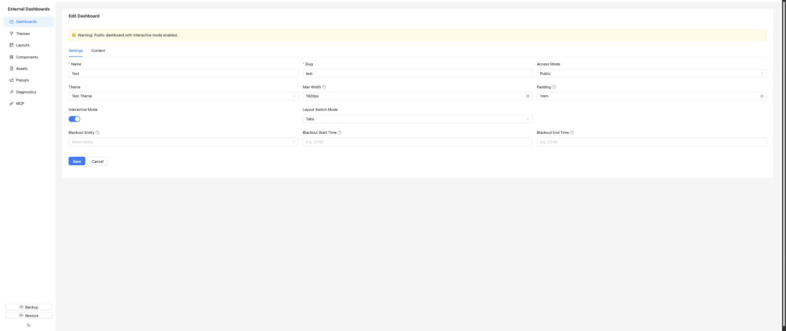
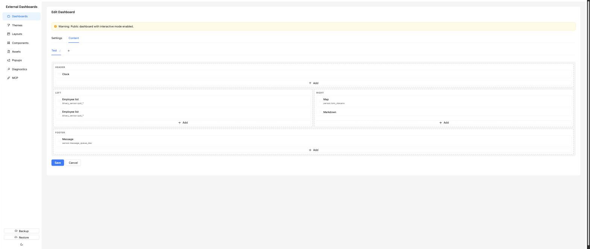

# Dashboards

The top sidebar entry. A dashboard is the thing you actually open in a browser — it ties together a theme, one or more layouts, and the component instances placed inside those layouts.

## List page

Columns shown: **Name**, **Slug**, **Access** (tag coloured by mode), **Entities** (count of distinct HA entities the dashboard subscribes to), **Interactive**. The page-level button is *New Dashboard*. Per-row actions:

- **Open** — opens the external URL in a new tab. Disabled with a tooltip until `EXTERNAL_BASE_URL` is set.
- **Edit**, **Duplicate**, **Delete**.

Dashboards can be deleted freely — there is no cascade guard here; delete only affects the dashboard itself.

## Editor — Settings tab

The main form fields, top to bottom:

- **Name** — human label.
- **Slug** — used in the URL (`/d/<slug>`). Lowercase letters, digits, and hyphens only.
- **Theme** — the theme the dashboard renders with.
- **Max Width** — optional CSS value (e.g. `1200px`, `90vw`) that caps the content width of the rendered dashboard. Leave blank for full width.
- **Padding** — optional CSS padding applied around the dashboard content area.
- **Access Mode** — controls who can open the dashboard. See the table below.
- **Interactive Mode** — when on, the display can call HA services (e.g. from a button's `onclick`). Off by default; calls are rate-limited at 10/sec and entity-scoped to the dashboard.
- **Layout Switch Mode** — *Tabs* (user switches tabs) or *Auto Rotate* (cycles through layouts on an interval; the rotate interval field appears when this is selected).
- **Blackout Entity / Start Time / End Time** — optional. Blacks out the dashboard entirely (pure black overlay) when the chosen binary_sensor is `on`, or between the given HH:MM times, or both (OR logic). Overnight ranges like `23:00`–`07:00` work as expected. Time is checked every 30 seconds client-side.

### Access modes

| Mode | What it does | Extra fields |
|------|--------------|--------------|
| Disabled | Returns 403 — the dashboard is effectively off. | — |
| Public | Anyone with the URL can view. | — |
| Password | User is prompted for a password. Password is hashed (bcrypt) and stored in the DB; successful login sets a 24h JWT session cookie. | Password |
| Header | Caller must send a specific HTTP header/value (useful behind a reverse proxy with SSO). | Header name + expected value |

Each dashboard also has an internal **access key** (a UUID) used for the WebSocket connection. It rotates via the *Regenerate Key* action in the editor and is embedded in the URL automatically when you click *Open*.

## Editor — Content tab

The Content tab is where you configure the per-layout tabs that make up the dashboard and drop component instances into the regions of each layout.

A dashboard can use one or more layouts — each becomes a tab (or a rotation step when auto-rotating). Use the *+ Add Layout* button to create a new dashboard tab entry. Each tab row has these properties:

- **Layout** — which layout definition it uses.
- **Label** and **Icon** — shown in the tab bar on the display.
- **Sort order** — drag to reorder.
- **Hide in tab bar** — the tab is still switchable programmatically (via the popup/switch-layout trigger or a visibility rule becoming true) but doesn't appear as a clickable button.
- **Auto return** / **Auto return delay** — after being switched to, the dashboard returns to the previously-active tab after N seconds. Useful for flash-on-event views (doorbell, alarm, etc.).
- **Visibility rules** — JSON conditions over entity state. When all rules of the currently active tab become false, the display auto-switches to the first visible tab. When a tab's rules become true, it is auto-switched to.

Below the tab list is the **visual layout editor**. The selected layout's grid is rendered; each region is a drop zone. Click a region to pick a component, or click an existing component instance to open its config modal.

The component configuration modal has three parts:

- **Parameter values** — one input per parameter defined on the component, rendered according to the parameter type (string, number, boolean, color, select, icon, asset, textarea).
- **Entity bindings** — one entity picker per entity selector defined on the component. Single / multiple / glob mode is inherited from the component definition. Globs (e.g. `sensor.*_temperature`) are expanded server-side at WebSocket connect time.
- **Visibility rules** — optional per-instance conditions. The instance is hidden client-side when rules evaluate to false.

Container components behave slightly differently — they have their own child regions you can drop further components into (for example, a tabbed card container).

## Interactive mode

Interactive mode is a dashboard-level toggle on the Settings tab. When enabled:

- The display app can send `call_service` commands to Home Assistant through the WebSocket proxy.
- Only entities actually used by the dashboard can be controlled.
- Commands are rate-limited to 10 per second per connection.
- The admin warns if a public dashboard has interactive mode enabled.

## Gotchas

- Changing the slug changes the URL. Existing tablets bookmarking the old URL will 404.
- Password mode stores a bcrypt hash; there is no "show current password". To reset it, type a new one and save.
- The entity count on the list is everything the dashboard actually subscribes to: bound entities, visibility rule entities, the blackout entity, and any glob expansions. That number drives WebSocket filtering on the external server.
