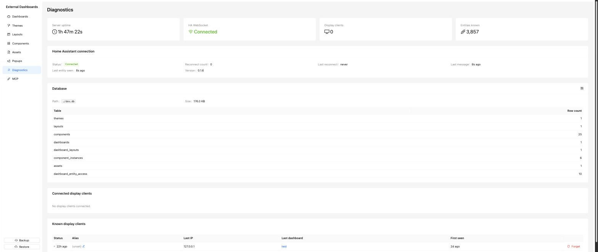

# Diagnostics

Read-only health and monitoring page. Useful when debugging "my tablet isn't showing anything."

## Top stat cards

- **Server uptime** — how long the add-on process has been running.
- **HA WebSocket** — Connected / Disconnected.
- **Display clients** — how many tablets/browsers are currently connected.
- **Entities known** — total count of HA entities the add-on has cached.

## Home Assistant connection

Details shown below the stat cards:

- **Status** — Connected / Disconnected.
- **Reconnect count** — how many times the add-on has had to reconnect to HA since boot.
- **Version** — the Home Assistant Core version reported over the WebSocket.
- **Last message** — timestamp of the most recent event received from HA.
- **Last entity seen** — the last entity id that produced a state change.
- **Last reconnect** — timestamp of the last reconnect event.

## Database

A table showing the SQLite database path, file size on disk, and per-table row counts (themes, layouts, components, dashboards, instances, assets, etc.).

## Connected display clients

A live count of the tablets and browsers currently holding an open WebSocket connection to the external server.

## Known display clients

A table of every display that has connected at least once, with columns:

- **Status** — online / offline, with a "last seen" time.
- **Alias** — editable. Name the kitchen tablet "kitchen" instead of a raw browser UUID; the alias shows up everywhere else a display is referenced.
- **Last IP** — the IP the display last connected from.
- **Last dashboard** — the dashboard slug the client was last viewing.
- **First seen** — when the client first connected.
- **Forget** — removes the client record.

Use the alias column to label your tablets — the names show up everywhere else a display is referenced.
