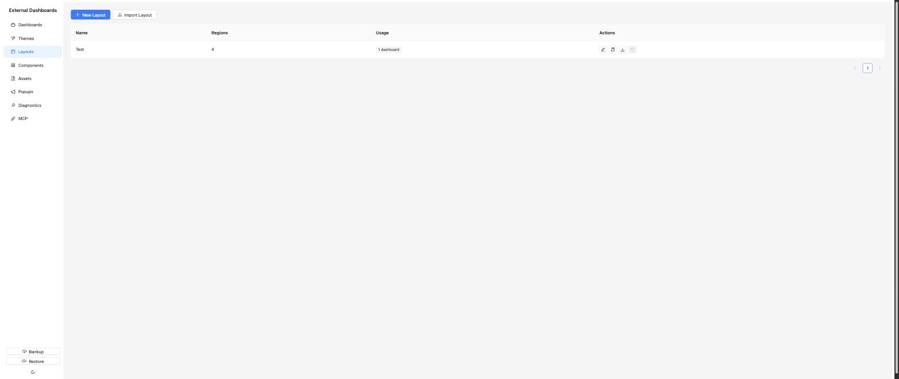
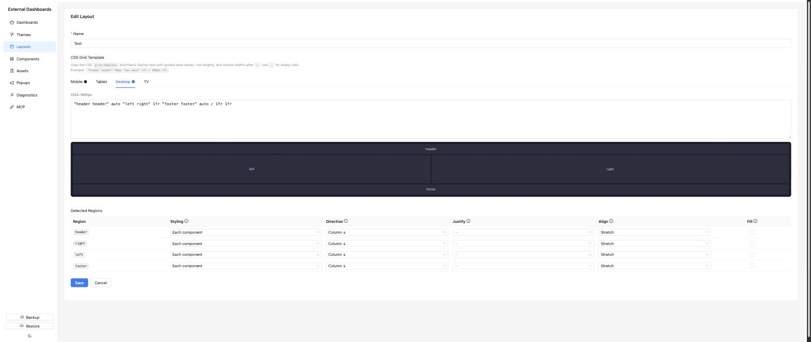

# Layouts

A layout is a CSS grid plus per-region styling hints. Regions are discovered automatically from the grid template — anything you name (the quoted areas) shows up as a region you can configure.

## List page



Columns: **Name**, **Regions** (count), **Usage** (dashboards). Page actions: *New Layout*, *Import Layout*. Per-row: *Edit*, *Duplicate*, *Export*, *Delete* (blocked when in use).

## Editor



- **Name** — required.
- **CSS Grid Template** — the heart of the layout. Uses the `grid-template` shorthand, for example:
  ```
  "header header" 60px
  "nav main" 1fr
  / 200px 1fr
  ```
  Use `.` for empty cells.

  The template editor has four responsive **breakpoint tabs** — **Mobile**, **Tablet**, **Desktop** and **TV**. Each can have its own grid template; the display picks the one matching the viewport. A filled dot next to the tab label indicates the breakpoint has a template defined.

- **Live preview** — a visual rendering of the grid for the currently selected breakpoint, updated as you type.

- **Detected Regions** — a table populated from the areas in your grid template. Columns per region:
  - **Styling** (`applyChromeTo`) — whether the theme's background, border and padding wrap *each component individually* (*Each component*, the default) or the *whole region* as one panel (*Whole region*). Choose *Whole region* when you want a single card that contains multiple visual elements without borders between them.
  - **Direction** — flex direction for components inside the region.
  - **Justify** — main-axis alignment.
  - **Align** — cross-axis alignment.
  - **Fill** — whether components flex-grow to fill the region.

## Import / export

Exported files are JSON. On import, if a layout with the same name already exists the new one is suffixed with `(Imported)` to avoid collisions.

## Gotchas

- Renaming a region in the grid template orphans any component instance placed in the old region. Rename regions only when you're ready to repopulate them.
- Layouts in use cannot be deleted (409).
