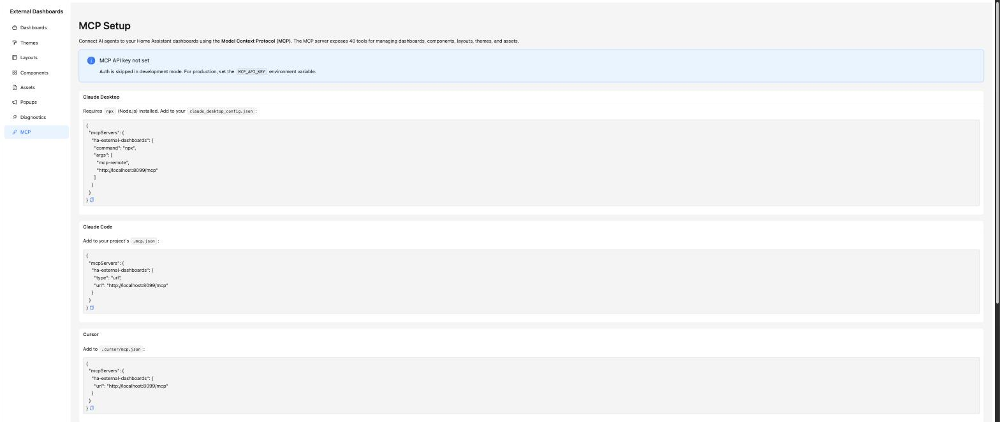

# MCP

The add-on ships an MCP (Model Context Protocol) server so AI agents can manage the add-on programmatically. This page is a read-only config generator — it inspects your current environment and produces copy-paste configs for common MCP clients.



## What's on the page

- The MCP endpoint is `POST <EXTERNAL_BASE_URL>/mcp`.
- Auth is a bearer token from the `MCP_API_KEY` environment variable. If the key is unset, a banner warns that the endpoint will return 503 in production (auth is skipped when `NODE_ENV=development`).
- Four configuration cards, each with a copy button:
  - **Claude Desktop** — uses `npx mcp-remote` to bridge the Streamable HTTP endpoint into a local stdio client.
  - **Claude Code** — drops into a `.mcp.json` URL form.
  - **Cursor** — drops into `.cursor/mcp.json`.
  - **Generic** — a provider-agnostic snippet that any MCP-aware tool can consume.

If `EXTERNAL_BASE_URL` is unset, the page shows a warning — without it, the generated URL falls back to a placeholder that clients won't be able to reach. Set it via the add-on configuration (`external_base_url`) or as an env var.

## Example snippet

The Claude Desktop card produces something like:

```json
{
  "mcpServers": {
    "ha-external-dashboards": {
      "command": "npx",
      "args": [
        "mcp-remote",
        "http://192.168.1.100:8099/mcp",
        "--header",
        "Authorization: Bearer <your-mcp-api-key>"
      ]
    }
  }
}
```

## Tool surface

Approximately 40 tools are exposed, covering full CRUD on dashboards, components, layouts, themes and assets, plus `ha_entities_list` (search HA entities by domain/state/attribute) and `dashboard_trigger_switch_layout` (switch a dashboard's active tab remotely).

For the full tool list, request/response shapes, and payload examples, see [../api-reference.md](../api-reference.md).
