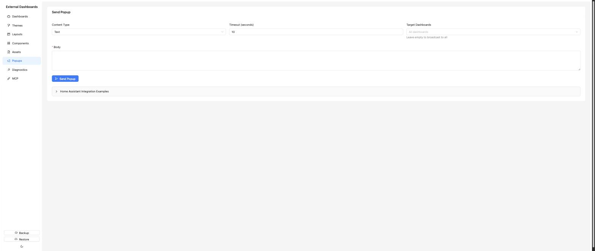

# Popups

An admin-only page for sending a one-off popup overlay to one or more displays — text, image, or video. Ephemeral: popups are not stored. This is the same mechanism the `POST /api/trigger/popup` endpoint uses.



## Form fields

- **Content Type** — dropdown: Text / Image / Video. Changes the rest of the form:
  - *Text*: multi-line body.
  - *Image* or *Video*: pick an asset (filtered by mime type) **or** paste an external URL.
- **Timeout** — seconds before the popup auto-dismisses. Default is 10.
- **Target Dashboards** — optional multi-select. If empty, the popup is broadcast to all displays. If set, only displays showing one of the chosen dashboards receive the popup.
- **Body** — the textarea that holds the message (for Text) or the URL / asset reference (for Image / Video).

Below the form there is an expandable **Home Assistant Integration Examples** section with copy-ready snippets for calling the endpoint from HA `rest_command:` — text, image, video, and targeted variants. Example payload:

```yaml
rest_command:
  popup_text:
    url: "http://external_dashboards:8080/api/trigger/popup"
    method: POST
    content_type: "application/json"
    payload: '{"content":{"type":"text","body":"{{ message }}"},"timeout":10}'
```

For the full REST payload reference (all fields, authentication, rate limits), see [../api-reference.md](../api-reference.md).

## Triggering via HA Events

Instead of a `rest_command`, you can fire a native HA event directly from an automation or script. The add-on listens on its existing HA WebSocket connection for `external_dashboards_popup` events — no extra HTTP call required.

### Event fields

| Field | Type | Required | Description |
|---|---|---|---|
| `content.type` | `text` \| `image` \| `video` | Yes | Content type |
| `content.body` | string | For `text` | Message body |
| `content.mediaUrl` | string | For `image`/`video` | URL or asset path |
| `timeout` | integer (seconds) | No (default 10) | Auto-dismiss after |
| `target_dashboards` | list of slugs | No (default all) | Limit to specific dashboards |

### Examples

**Text popup to all displays:**

```yaml
action: event
event_type: external_dashboards_popup
event_data:
  content:
    type: text
    body: "Motion detected in the garden!"
  timeout: 15
```

**Image popup targeted to specific dashboards:**

```yaml
action: event
event_type: external_dashboards_popup
event_data:
  content:
    type: image
    mediaUrl: "/local/cameras/front-door.jpg"
  timeout: 20
  target_dashboards:
    - living-room
    - hallway
```

**In an automation:**

```yaml
automation:
  - alias: "Doorbell popup"
    trigger:
      - platform: state
        entity_id: binary_sensor.doorbell
        to: "on"
    action:
      - event: external_dashboards_popup
        event_data:
          content:
            type: text
            body: "Someone is at the door!"
          timeout: 30
```

> **Note:** The dashboard slug is the URL-friendly identifier shown in the admin UI (e.g. a dashboard at `/d/living-room` has slug `living-room`).

## Gotchas

- The REST endpoint is admin-scoped (uses HA ingress auth) and **rate-limited to 10 requests/second**. Bursting more will drop requests. The HA event path has no rate limit, so fire responsibly.
- Videos must be a format the display browser can play (typically `.mp4`/H.264).
- There is no "close all popups" control — they clear themselves when the timeout elapses.
- Invalid event data (wrong content type, non-integer timeout, etc.) is silently dropped with a server-side warning in the add-on logs.
