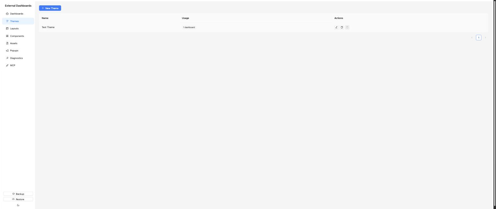
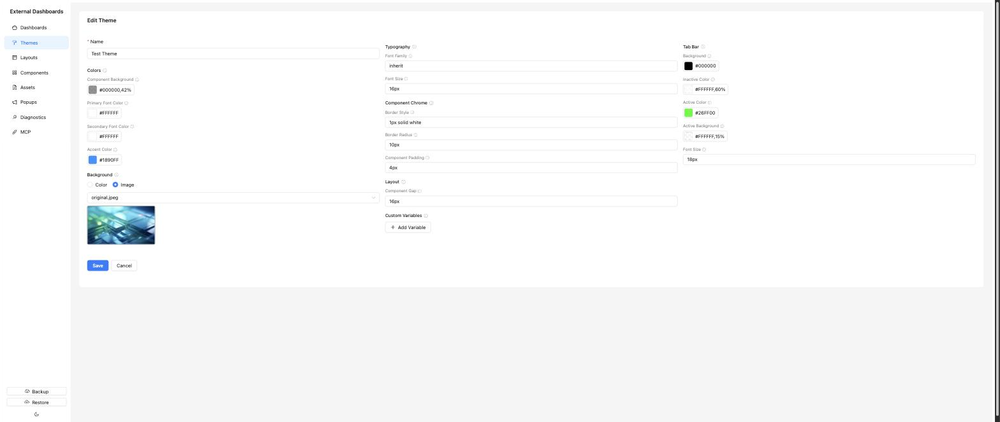

# Themes

Themes are a palette of CSS variables plus any custom variables you want to add. Components read these variables to keep visuals consistent — the renderer itself also applies theme "chrome" (background, border, radius, padding) around components or regions based on the layout's `applyChromeTo` setting, so components don't need to reinvent their outer frame.

## List page

Columns: **Name**, **Usage** (how many dashboards use it). Actions: *New Theme*, per-row *Edit* / *Duplicate* / *Delete*.

A theme cannot be deleted while any dashboard references it — the server returns 409 and the admin shows the usage count.

## Editor

The editor is grouped into these sections:

**Name** — required, shown everywhere the theme is referenced.

**Colors**
- Component Background
- Primary Font Color
- Secondary Font Color
- Accent Color

**Background** — the full page background behind all layouts. A Color/Image toggle switches the controls between a solid color and an image asset picker.

**Typography**
- Font Family
- Font Size

**Component Chrome**
- Border Style
- Border Radius
- Component Padding

These are applied externally by the renderer around components or regions (depending on the layout's `applyChromeTo` setting), not inside each component's CSS.

**Layout**
- Component Gap — spacing between components inside a region.

**Tab Bar**
- Background
- Inactive Color
- Active Color
- Active Background
- Font Size

**Custom Variables** — free-form key/value pairs that become CSS variables (e.g. key `myBrandBlue`, value `#0055aa` → `var(--myBrandBlue)`). Accessible from templates too as `{{globalStyles.myBrandBlue}}`.

Every section has sensible defaults that merge with whatever you set — you only need to fill in what you want to override.

## Gotcha

- Theme changes cascade: saving a theme triggers a reload on every dashboard that uses it. Expect to see tablets blink briefly on save.
